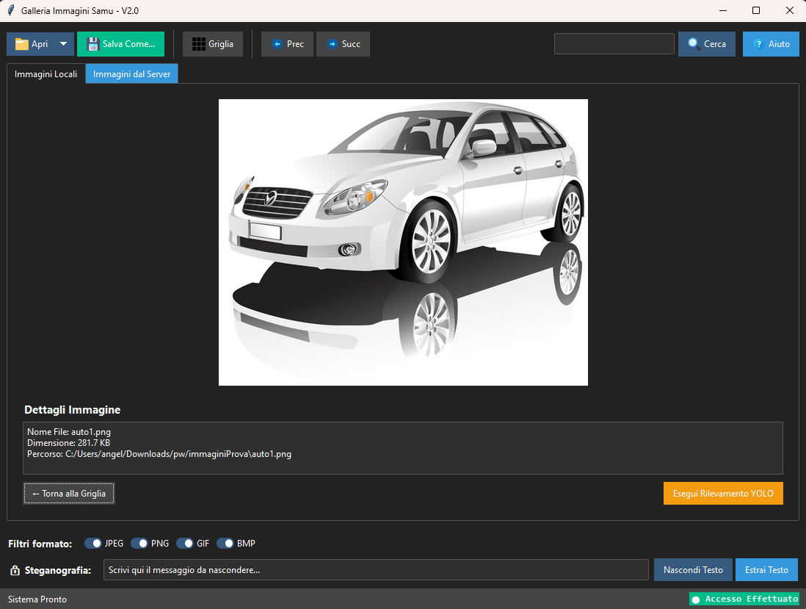
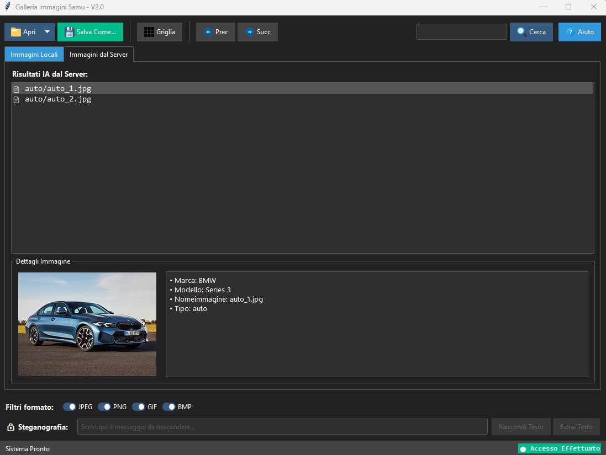

# Galleria Immagini con Steganografia

Applicazione desktop Python con backend Flask e MongoDB per:

- gestione immagini locali (griglia, presentazione, ricerca, filtri)
- autenticazione JWT verso API
- consultazione immagini e metadati dal server
- rilevamento oggetti con YOLO locale
- steganografia LSB su immagini PNG

## Anteprima

<p align="center">
    
    
</p>


## Architettura del progetto

- `gui/`: interfaccia desktop Tkinter + ttkbootstrap
- `Server_API/`: API Flask con JWT e MongoDB
- `Server_API/immagini_server/`: immagini servite dalla API
- `docker-compose.yml`: avvio di MongoDB + API

## Requisiti

### 1. Software necessario

- Python 3.11+ (consigliato)
- pip aggiornato
- Docker Desktop (o Docker Engine + Docker Compose)

### 2. Dipendenze Python

Il progetto usa due requirements ufficiali:

- `gui/requirements.txt`
- `Server_API/requirements.txt`

In base agli import reali della GUI, servono anche:

- `requests`
- `ultralytics` (per il rilevamento YOLO locale)

## Setup rapido per un nuovo utente

### 1. Clona il repository

```bash
git clone https://github.com/H1R05/GalleriaIMG_Steganografia.git
cd GalleriaIMG_Steganografia
```

### 2. Crea e attiva un virtual environment

Windows PowerShell:

```powershell
python -m venv .venv
.\.venv\Scripts\Activate.ps1
```

Windows CMD:

```bat
python -m venv .venv
.venv\Scripts\activate.bat
```

macOS/Linux:

```bash
python3 -m venv .venv
source .venv/bin/activate
```

### 3. Installa dipendenze

```bash
pip install --upgrade pip
pip install -r gui/requirements.txt
pip install -r Server_API/requirements.txt
pip install requests ultralytics
```

Nota: il file del modello `gui/yolov8n.pt` deve essere presente (nel repository c'e' gia').

## Configurazione variabili ambiente

Il `docker-compose.yml` richiede queste variabili:

- `MY_APP_SECRET_KEY`
- `MY_MONGO_URI`

Crea un file `.env` nella root del progetto:

```env
MY_APP_SECRET_KEY=metti_una_chiave_lunga_e_sicura
MY_MONGO_URI=mongodb://mongodb:27017/galleria_cloud
```

Perche' `mongodb` e non `localhost`? Perche' il server Flask gira nel container e deve raggiungere il servizio MongoDB interno di Docker Compose.

## Avvio backend (API + MongoDB)

Dalla root del progetto:

```bash
docker compose up --build
```

Servizi previsti:

- API Flask: `http://localhost:5000`
- MongoDB: `localhost:27017`

Per fermare i servizi:

```bash
docker compose down
```

## Preparazione dati minimi in MongoDB

L'applicazione login e metadati leggono da MongoDB:

- database: `galleria_cloud`
- collection utenti: `utenti`
- collection metadati: `metadati`
- collection log ricerche: `log_ricerche`

Inserisci almeno un utente nella collection `utenti` per il login standard:

```json
{
	"username": "admin",
	"password": "admin123"
}
```

Esempio documento metadati (collection `metadati`):

```json
{
	"nomeImmagine": "foto1.jpg",
	"tipo": "auto",
	"descrizione": "Auto rossa",
	"autore": "Mario"
}
```

Nota: per la ricerca metadati lato API i campi chiave sono `nomeImmagine` e `tipo`.

## Avvio GUI desktop

Con venv attivo, dalla root del progetto:

```bash
python gui/main.py
```

## Modalita' di accesso disponibili

- `Accedi al Sistema`: usa username/password e ottiene JWT dal server
- `Accedi come ospite`: modalita' offline (senza token/server)

## Guida uso funzionalita'

### 1. Immagini locali

- Apri una cartella o un singolo file immagine
- Filtra per formato (JPEG, PNG, GIF, BMP)
- Cerca per nome file
- Visualizza in griglia o presentazione
- Salva copia con `Salva Come...`

### 2. Steganografia

- Scrivi un messaggio nel campo in basso
- Premi `Nascondi Testo` su un'immagine PNG
- Premi `Estrai Testo` per leggere il messaggio nascosto

### 3. YOLO locale + server

- In presentazione premi `Esegui Rilevamento YOLO`
- L'etichetta rilevata viene mappata alle categorie: `persona`, `auto`, `treno`, `aereo`, `altro`
- La tab `Immagini dal Server` consente ricerca file e metadati via API

## API principali (riferimento)

- `POST /login`
- `GET /api/images?tipoImmagine=...`
- `GET /api/metadata?nomeImmagine=...&tipo=...`
- `GET /api/images/download/<path:nome_file>`

Tutte le API sotto `/api/*` richiedono header:

```http
Authorization: Bearer <jwt>
```

## Troubleshooting

### Errore login o server non raggiungibile

- verifica che `docker compose up --build` sia attivo
- controlla che la porta 5000 non sia occupata

### Errore JWT non valido

- assicurati che `MY_APP_SECRET_KEY` sia impostata
- riavvia i container dopo modifiche al `.env`

### Metadati non trovati

- verifica presenza documento in collection `metadati`
- controlla corrispondenza esatta di `nomeImmagine` e `tipo`

### YOLO non funziona

- conferma installazione `ultralytics`
- verifica presenza file `gui/yolov8n.pt`

## Note utili per sviluppo

- Il backend gira in debug nel container (`app.run(..., debug=True)`).
- Le immagini server sono lette da `Server_API/immagini_server`.
- Il volume Docker `dati_mongo` mantiene i dati MongoDB persistenti.

## Autore

Samuele - https://github.com/H1R05
